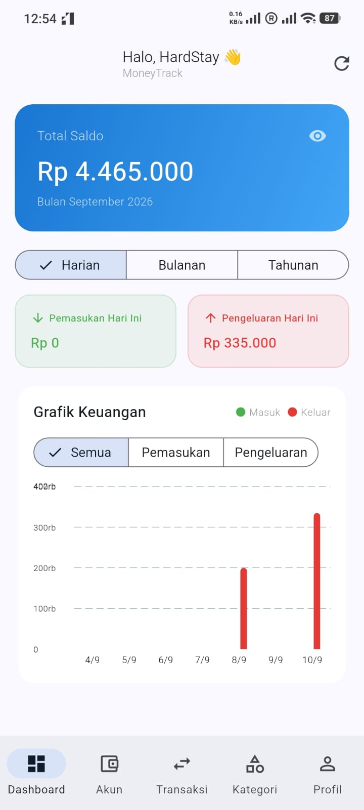
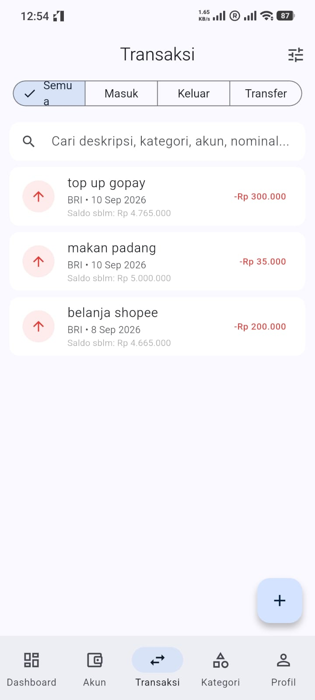
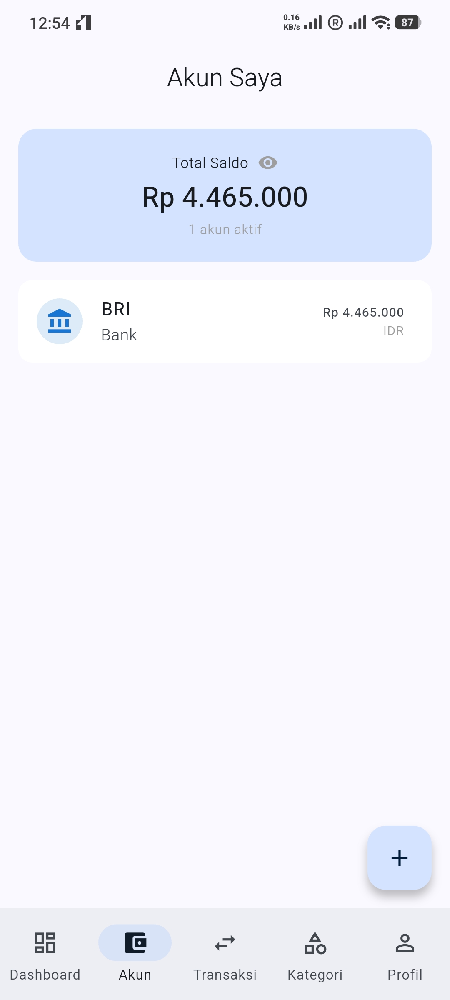
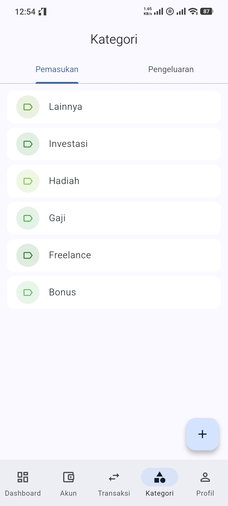

# MoneyTrack Mobile 📱💰

> A high-performance, cross-platform personal finance and multi-currency tracking mobile application built with Flutter and Supabase.

[](https://flutter.dev)
[](https://dart.dev)
[](https://supabase.com)
[](https://www.postgresql.org)

---

## 🎯 Overview

**MoneyTrack Mobile** is a feature-rich, production-grade personal finance application designed to help users take full control of their financial lives. Built as a native cross-platform mobile app using **Flutter**, it connects seamlessly to a robust **Supabase** backend backed by **PostgreSQL**. 

The app addresses the common pain points of fragmented personal finance management: tracking multiple accounts (bank accounts, e-wallets, cash, and investments) across different currencies (IDR and CNY), categorizing income and expenses, visualizing spending habits over customizable time periods, and ensuring absolute data consistency through relational database constraints and automated triggers.

---

## ✨ Key Features

- **🔒 Secure Authentication**: Robust email/password authentication powered by Supabase Auth with automated session persistence and navigation guards (`GoRouter`).
- **💳 Multi-Account & Multi-Currency Management**: Manage multiple financial accounts (Bank, E-Wallet, Cash, Investment) with native currency support (`IDR`, `CNY`).
- **📊 Real-Time Financial Dashboard**: Dynamic summary cards with flexible period filtering (Daily, Monthly, Yearly) and interactive bar charts (`fl_chart`) visualizing income vs. expense trends.
- **💸 Advanced Transaction Management**: Record incomes, expenses, and wallet-to-wallet transfers with instant balance updates, debounced global search across descriptions, categories, accounts, and amounts, and date filter presets.
- **✅ Batch Selection & Multi-Currency Totals**: Long-press transaction items to enter selection mode, perform multi-select, and view aggregated income/expense totals grouped by currency in real time.
- **👁️ Privacy Shield**: One-tap balance masking/visibility toggle to protect sensitive financial data in public environments.
- **⚡ Performance & Caching**: Local memory caching (3-minute validity) and pagination for seamless scrolling and reduced database query overhead.

---

## 📸 Screenshots & Demo

| Dashboard View | Transactions | Accounts & Wallets | Categories |
| :---: | :---: | :---: | :---: |
|  |  |  |  |

---

## 🛠️ Tech Stack

### Frontend (Mobile)
- **Framework**: Flutter (`^3.10.4`) / Dart
- **Navigation**: `go_router` (`^14.8.1`) for declarative routing and auth redirection
- **Charts**: `fl_chart` (`^0.69.0`) for interactive financial analytics
- **Localization & Formatting**: `intl` (`^0.20.2`) for currency and date formatting (`id_ID`, `zh_CN`)
- **Local Storage**: `shared_preferences` (`^2.5.3`) for persistent user preferences

### Backend & Database
- **BaaS**: Supabase (`supabase_flutter` `^2.9.0`)
- **Database**: PostgreSQL with custom PL/pgSQL functions and triggers for atomic balance calculations
- **Authentication**: Supabase Auth (JWT-based session management)

### Development Tools
- **IDE**: Visual Studio Code / Android Studio
- **Version Control**: Git & GitHub

---

## 📐 System Architecture

MoneyTrack Mobile follows a layered, feature-driven architecture. The client application communicates directly with the Supabase backend via the Supabase Flutter SDK, delegating business-critical ledger computations (such as balance updates upon transaction insertion or deletion) to PostgreSQL database triggers to guarantee ACID compliance.

```mermaid
graph TD
    User([User]) -->|Interacts| UI[Flutter Mobile App<br/>(GoRouter & UI Widgets)]
    UI -->|Auth & Queries| SupabaseSDK[Supabase Flutter SDK]
    SupabaseSDK -->|REST / Realtime / RPC| SupabaseCloud[Supabase Backend Cloud]
    SupabaseCloud -->|Executes Triggers| Postgres[(PostgreSQL Database)]
    Postgres -->|Auto-updates Balance| AccountsTable[(accounts table)]
    Postgres -->|Records Ledger| TxTable[(transactions table)]
```

---

## 📁 Project Structure

```text
moneyTrackMobile/
├── screenshots/             # App preview screenshots for portfolio
├── lib/
│   ├── core/
│   │   ├── config/          # Supabase configuration & API keys
│   │   ├── router/          # GoRouter navigation & auth guards
│   │   ├── theme/           # App theme definitions
│   │   └── balance_visibility.dart # Privacy state
│   ├── features/
│   │   ├── accounts/        # Account management screens & form sheets
│   │   ├── auth/            # Login and Register screens
│   │   ├── categories/      # Category management screens & form sheets
│   │   ├── dashboard/       # Dashboard summary cards & FL Chart widgets
│   │   ├── home/            # Shell navigation scaffold
│   │   ├── profile/         # User profile & session controls
│   │   └── transactions/    # Transaction lists, search, date filters, add/edit form
│   └── main.dart            # Application entry point & Supabase initialization
├── android/                 # Android native configuration
├── ios/                     # iOS native configuration
├── windows/                 # Windows desktop configuration
├── macos/                   # macOS desktop configuration
├── web/                     # Web support configuration
└── pubspec.yaml             # Dependencies and asset declarations
```

---

## 🔄 User & Data Flow

1. **Authentication Flow**:
   - On app launch (`main.dart`), Supabase initializes and `GoRouter` checks the current user session.
   - If unauthenticated, the user is redirected to `/login`. Upon successful authentication, they proceed to `/dashboard`.
2. **Dashboard & Summary Flow**:
   - `DashboardScreen` fetches active user accounts and computes aggregate balances grouped by currency (`IDR`, `CNY`).
   - Transaction totals (income and expense) for the selected period (day, month, year) are calculated and cached for 3 minutes to optimize performance.
3. **Transaction Lifecycle & Database Triggers**:
   - When a user adds or deletes a transaction (`transactions_screen.dart`), the PostgreSQL database executes `update_account_balance()` trigger function automatically, recalculating account current balances safely without race conditions.

---

## 🚀 Getting Started

### Prerequisites
- [Flutter SDK](https://docs.flutter.dev/get-started/install) (`^3.10.4` or higher)
- Dart SDK
- Android Studio / Xcode (for mobile emulation) or a connected physical device

### Installation

1. **Clone the repository**:
   ```bash
   git clone https://github.com/HardyFebryan/moneyTrack.git
   cd moneyTrack/moneyTrackMobile
   ```

2. **Install dependencies**:
   ```bash
   flutter pub get
   ```

3. **Configure Environment / Supabase**:
   Verify or update your Supabase credentials in `lib/core/config/supabase_config.dart`:
   ```dart
   class SupabaseConfig {
     static const String url = 'https://blablabla.supabase.co';
     static const String anonKey = 'anonKey';
   }
   ```

4. **Run the application**:
   ```bash
   flutter run
   ```

---

## 🗄️ Database Schema & Architecture

The application relies on a relational PostgreSQL schema hosted on Supabase:

- **`users`**: Managed by Supabase Auth (linked via UUID/SERIAL).
- **`accounts`**: Stores wallet details (`name`, `type`: bank/ewallet/cash/investment, `currency_code`: IDR/CNY, `initial_balance`, `current_balance`).
- **`categories`**: User-specific or default categories for income and expenses (`name`, `type`, `color`, `icon`).
- **`transactions`**: Core ledger table recording `type` (income, expense, transfer), `amount`, `transaction_date`, `account_id`, `category_id`, and transfer-specific fields (`to_account_id`, `transfer_fee`).

**Automated Database Triggers**:
```sql
-- Example trigger function maintaining account balance integrity
CREATE OR REPLACE FUNCTION update_account_balance()
RETURNS TRIGGER AS $$
BEGIN
    IF TG_OP = 'INSERT' THEN
        IF NEW.type = 'income' THEN
            UPDATE accounts SET current_balance = current_balance + NEW.amount WHERE id = NEW.account_id;
        ELSIF NEW.type = 'expense' THEN
            UPDATE accounts SET current_balance = current_balance - NEW.amount WHERE id = NEW.account_id;
        ELSIF NEW.type = 'transfer' THEN
            UPDATE accounts SET current_balance = current_balance - NEW.amount - NEW.transfer_fee WHERE id = NEW.account_id;
            UPDATE accounts SET current_balance = current_balance + NEW.amount WHERE id = NEW.to_account_id;
        END IF;
        RETURN NEW;
    END IF;
    -- (DELETE handling implemented symmetrically)
END;
$$ language 'plpgsql';
```

---

## 💡 Challenges & Solutions

- **Multi-Currency Aggregation**: *Challenge*: Displaying unified financial summaries without incorrectly mixing distinct currencies like Indonesian Rupiah (IDR) and Chinese Yuan (CNY). *Solution*: Designed grouped map structures (`Map<String, double>`) across all dashboard cards and selection bars, allowing users to view currency-specific totals cleanly.
- **High-Performance Infinite Scrolling & Search**: *Challenge*: Handling large transaction datasets smoothly on mobile without UI stutter. *Solution*: Implemented paginated range queries (`.range()`), synchronous scroll guards (`_loadingMore`), debounced search inputs (`Timer`), and client-side multi-period caching (`_cacheByPeriod`).

---

## 📚 What I Learned

- Designing and building a production-ready mobile application with Flutter and GoRouter state management.
- Implementing robust database-level business logic using PostgreSQL triggers (`PL/pgSQL`) to ensure financial data integrity.
- Integrating complex UI widgets like interactive charts (`fl_chart`), custom date range filters, and batch selection interfaces.

---

## 🚀 Future Improvements

- Biometric authentication (Fingerprint / Face ID login).
- Receipt scanning & OCR auto-population for expense items.
- Monthly budgeting limits with push notifications.

---

## 👤 Author

**Hardy Febryan**

- GitHub: [HardyFebryan](https://github.com/HardStay)
- LinkedIn: [Hardy Febryan](https://www.linkedin.com/in/hardyfebryan01)

